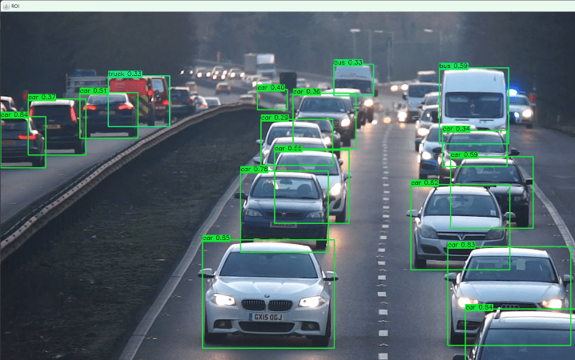
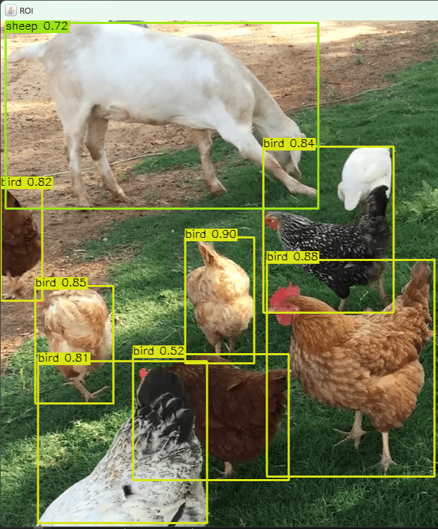
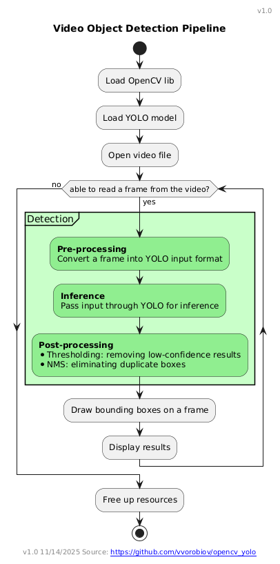
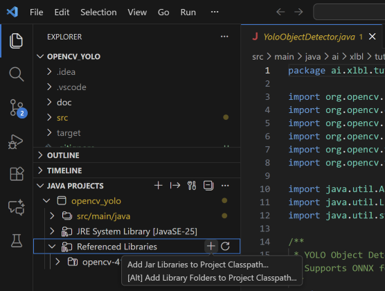
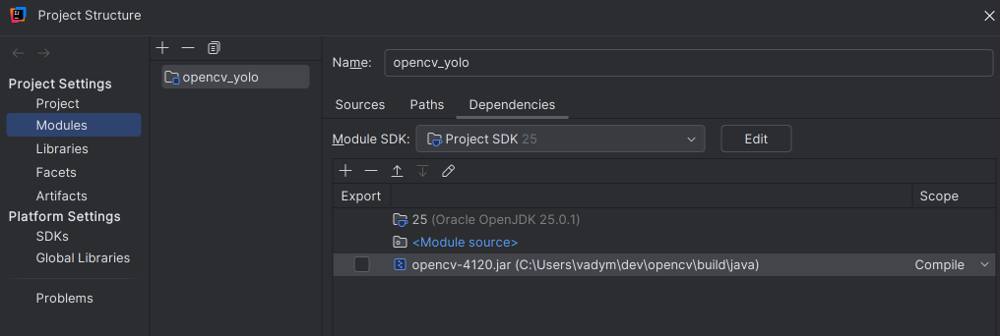
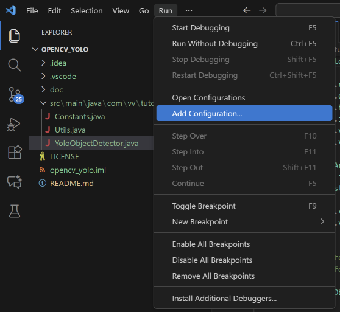
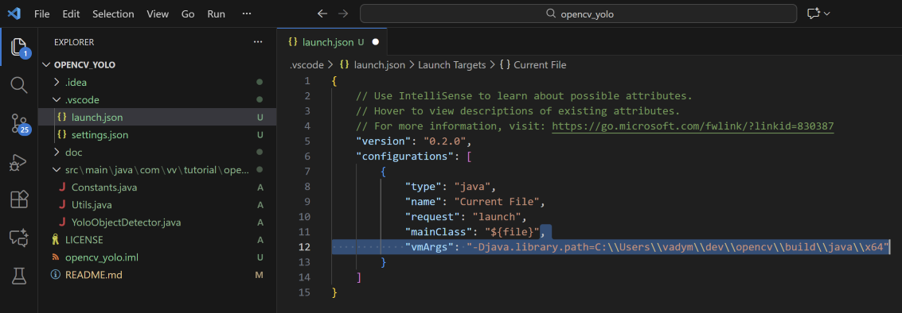
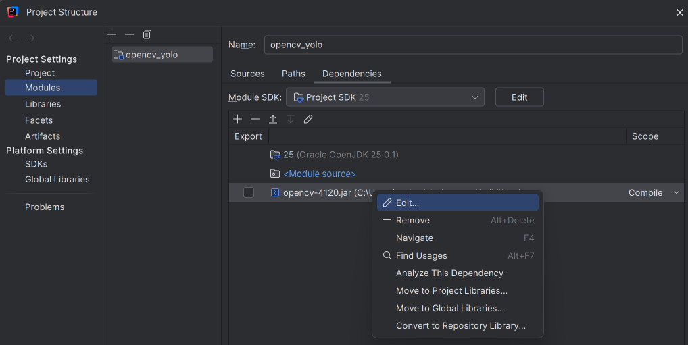
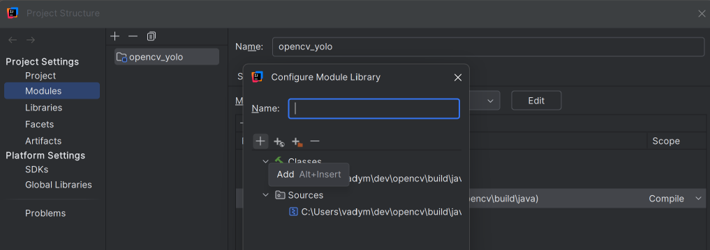
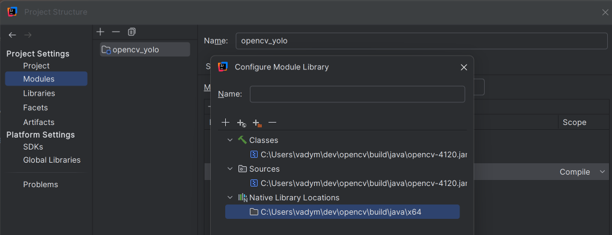

# OpenCV + Java + YOLO: Object Detection Tutorial

This tutorial explains how to detect objects in video with the help of OpenCV and pre-trained YOLO11 model.
Ultralytics YOLO11 is trained to detect 80 classes of objects.

## Here is the end result




Versions used in this tutorial:
* JDK 25
* Python 3.14.0
* OpenCV 4.12.0
* YOLO 11

> This version of tutorial runs only on **Windows OS** 
> 
> OpenCV is a set of libs written in C++ and the compiled into platform-native lib format: *.dll - for Windows, 
> or *.dylib - for Linux / Mac OS. 
> They can be accessed from Java via Java wrapper included into OpenCV distribution.


## Overview
Object detection pipeline will look like this:



## I. Installation

### Tools

1. Download and install [Visual Studio Build Tools for C++](https://visualstudio.microsoft.com/visual-cpp-build-tools/)

The only workolad needed to be installed is **Visual Studio Build Tools for C++**
> This is needed for compiling C++ libs coming with some Python packages

2. Download and install [Git](https://git-scm.com/install/windows)

Check if Git properly installed:

``` bash
git --version
```

### OpenCV
Download and extract [OpenCV Distribution](https://opencv.org/releases/) (Windows)

### YOLO 11
Ultralytics YOLO11 models by default available in PyTorch format (*.pt) and for interacting with the model from Java, it should be first exported into ONNX format.

Here is a full [ONNX Export for YOLO11 Models](https://docs.ultralytics.com/integrations/onnx/) article.
1. Install lastest [Python](https://www.python.org/downloads/]) 
2. Make sure you can run [pip](https://packaging.python.org/en/latest/tutorials/installing-packages/) - Python package installer:

``` bash
python -m pip --version
```

3. Create new virtual Python environment

Navigate to your development folder:
``` bash
cd C:\<my_dev_folder>
```

> Tip: Good thing to do when installing custom Python packages - to install them into virtual env, to avoid currupting and lib conflicts with your base Python installation. 

``` bash
python -m venv C:\<my_dev_folder>\venv\myultravenv
```

Activate virtual environment:

``` bash
myultravenv\Scripts\activate
```

4. Install Ultralytics Python package to your newly created virtual env:

``` bash
pip install ultralytics
```

5. Install ONNX Runtime

``` bash
pip install onnx
```

6. Finally, export YOLO11n PyTorch (*.pt) model to ONNX format

``` bash
yolo export model=yolo11n.pt format=onnx
```

7. Deactivate Python virtual environment

``` bash
deactivate
```
As result, you should see now two models added to your `C:\<my_dev_folder>`
* `yolo11n.pt`
* `yolo11n.onnx` - this is the one we need!

## II. Project setup

Open this project in your IDE and add `opencv-*.jar` lib to the classpath
> Note: **OpenCV JAR** is not available in Maven repo so have to add it to the project manually

The jar is located in OpenCV distribution folder:

`...\opencv\build\java\`

### Visual Studio Code
Add the jar to the project classpath via *JAVA PROJECTS* menu:



### IntelliJ IDEA
In IntelliJ IDEA it can be done via *Project Structure > Modules > Dependencies* menu:



## III. Code

In `YoloObjectDetector.java`:

1. Set full path (including filename) to `yolo11*.onnx` model:
``` java
static final String MODEL_PATH = "C:\\<full_path_to_the_model>\\yolo11n.onnx";
```

2. Set full path (including filename) to your video file model:
``` java
static final String VIDEO_PATH = "C:\\<full_path_to_the_video_file>\\<filename>.mp4";
```

Optional:
To add frame by frame processing, awaiting key press, set long delay (30s):
```java 
HighGui.waitKey(30000);
```

## IV. Run

### Running from Visual Studio Code
To run it from VS Code first we have to add native `opencv-*.dll` to the launch config:
1. Edit launch config via *Run > Add Configuration...* menu:



This will create `.vscode\launch.json` file in the project folder.


2. Add vmArg to the config:
``` json
"vmArgs": "-Djava.library.path=C:\\Users\\vadym\\dev\\opencv\\build\\java\\x64"
```
As result `launch.json` should look like this:


3. Run
`YoloObjectDetector.main()`

### Running from IntelliJ IDEA
To run it from IDEA first we have to add native `opencv-*.dll` to the project:

1. Navigate to *Project Structure > Modules > Dependencies* menu, right-click on `opencv-*.jar` and click *Edit...*


2. Click *Add* and select `opencv_java*.dll` file

The dll is available in OpenCV distribution folder:
`...\opencv\build\java\x64\opencv_java4120.dll`



As result, you should see native lib added to the list:


3. Run 
`YoloObjectDetector.main()`

## Happy Detecting!

